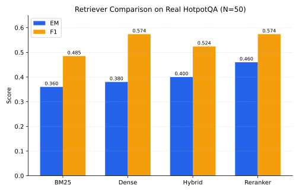

# Cross-Pipeline Transferability of Knowledge Poisoning in Adaptive RAG

Undergraduate thesis project by Sadia Peerzada, studying how knowledge-poisoning
attacks on Retrieval-Augmented Generation (RAG) systems transfer across
different retrieval pipelines, and evaluating a retrieval-consistency defense
against them. See the project foundation doc (shared separately) for the full
12-week roadmap and research plan.

## What this repo demonstrates so far

This isn't a single script that "ran once" -- it's a working, tested,
version-controlled research pipeline built incrementally, with real bugs
found and fixed along the way rather than hidden:

- **Built four retrieval strategies from scratch** (BM25, dense embedding
  retrieval, hybrid fusion, cross-encoder reranking) behind a shared
  interface, so any of them can be swapped into an experiment via config
  alone -- no code changes needed per retriever.
- **Built a generator abstraction supporting two real hardware backends**:
  MLX for local inference on Apple Silicon, and `transformers` +
  `bitsandbytes` 4-bit quantization for CUDA GPUs (Kaggle). Same interface,
  same experiment code, either backend.
- **Ran a real, reproducible pilot experiment**: all four retrievers,
  evaluated on the same 50 real HotpotQA questions (same seed, so it's a
  fair comparison), with a real 7B instruction model doing the generation
  -- not a toy dataset, not a mock model.
- **Found and fixed five real bugs** during development (details below),
  rather than shipping results that happened to work by accident.
- **Closed a reproducibility gap** (review issue #8): every logged result now
  carries `git_commit_sha`, Python/torch/transformers/sentence-transformers
  versions, and actual device -- so a future silent regression (like bug #4
  below) would show up as a mismatched fingerprint in the logs, not just as
  suspiciously-identical numbers.
- **Set up a dual-environment workflow**: local Mac for fast dev/debug
  iteration, Kaggle GPU for real generation runs, both syncing through this
  repo so neither environment silently drifts out of date with the other.

## Pilot result: retriever comparison on real data

All four retrievers tested end-to-end on real HotpotQA data (distractor
setting, N=50 sampled from validation, same seed across all four runs),
using `Qwen/Qwen2.5-7B-Instruct` (4-bit) on a Kaggle T4 GPU:

| Retriever |        EM |        F1 | Config                           | Raw log |
| --------- | --------: | --------: | -------------------------------- | ------- |
| BM25      |     0.360 |     0.485 | `exp_004_hotpotqa_kaggle.yaml`   | `experiments/exp_004_hotpotqa_kaggle/exp_004_hotpotqa_kaggle.jsonl` |
| Dense     |     0.380 |     0.574 | `exp_005_hotpotqa_dense.yaml`    | `experiments/exp_005_hotpotqa_dense/exp_005_hotpotqa_dense.jsonl` |
| Hybrid    |     0.400 |     0.524 | `exp_006_hotpotqa_hybrid.yaml`   | `experiments/exp_006_hotpotqa_hybrid/exp_006_hotpotqa_hybrid.jsonl` |
| Reranker  | **0.460** | **0.574** | `exp_007_hotpotqa_reranker.yaml` | `experiments/exp_007_hotpotqa_reranker/exp_007_hotpotqa_reranker.jsonl` |

**Reranking wins on exact match and ties dense retrieval on F1.**
Cross-encoder reranking of BM25's candidates gives the model the best
evidence of the four strategies tested. This is a real, reproducible
pilot finding, directionally useful for the next phase of the thesis --
**not yet a frozen benchmark result** (see caveat below).

## Retrieval evaluation

`top_k` is the number of retrieved documents included in the generator
prompt. It is independent from retrieval evaluation depth: each run requests
the top 10 ranked documents, computes Recall@1/@3/@5/@10 and
MRR@1/@3/@5/@10 from that ranking, and logs matched
`retrieved_doc_ids` and `retrieved_scores` arrays. nDCG@10 is also logged.
Queries without `gold_doc_ids` record `null` for these metrics and are
excluded from retrieval-metric averages.

Each run writes per-query records to `<experiment_id>.jsonl` and a separate
`<experiment_id>.summary.json` containing EM, F1, and mean retrieval metrics.
The regenerated mock smoke artifact, `results/exp_000_smoke_test.jsonl`,
verifies the end-to-end schema (10 aligned IDs/scores and all cutoff fields),
but it has no gold document labels, so its retrieval metrics are intentionally
`null` and its summary has no retrieval averages.

`configs/exp_009_hotpotqa_retrieval_eval_smoke.yaml` was run on 2026-09-01
against five real HotpotQA validation questions with BM25 and the mock
generator. Its current-code artifacts,
`results/exp_009_hotpotqa_retrieval_eval_smoke.jsonl` and
`results/exp_009_hotpotqa_retrieval_eval_smoke.summary.json`, contain ten
aligned ranked IDs/scores per query and non-null aggregate Recall/MRR metrics.
This verifies retrieval evaluation and canonical gold-ID handling only; its
mock-generator EM/F1 values are not generation-quality results.

Matching five-question current-code retrieval baselines were also generated
with dense, hybrid, and reranked retrieval:
`exp_010_hotpotqa_dense_metrics`, `exp_011_hotpotqa_hybrid_metrics`, and
`exp_012_hotpotqa_reranker_metrics`. Each has a JSONL log and summary in
`results/`, uses the same seed and generator evidence size (`top_k: 3`), and
reports the expanded retrieval schema. These small mock-generation runs verify
retrieval behavior across all four retrievers; they do not supersede the
historical 50-question real-generation EM/F1 pilot.

The committed HotpotQA pilot logs under `experiments/` and the corresponding
older files under `results/` were produced before this expanded schema: they
contain three-document rankings and no retrieval metrics. They remain the
historical record for the EM/F1 table above, not evidence for Recall or MRR.
Rerun the relevant configuration on its required MLX or CUDA environment to
produce comparable, expanded-metric pilot artifacts.

**Re-verified end-to-end on 2026-08-31**, after fixing a retriever-routing
regression that briefly made `run.py` ignore `config['retriever']` entirely
(see bug #4 below). All four experiments were re-run from scratch on the
fixed code, and the resulting EM/F1 numbers matched the original table
**exactly**, to three decimal places, across all four retrievers. Since
each config also visibly loaded different underlying components this
run (`BAAI/bge-small-en-v1.5` for dense/hybrid, `cross-encoder/ms-marco-MiniLM-L-6-v2`
for reranker), this is strong evidence the original numbers were genuinely
produced by correctly-routed retrievers, not by four accidental BM25 runs
or hand-entered placeholders. Raw per-query logs for all four runs are now
committed under `experiments/exp_00N_.../` (see table above) so every
number here is traceable to source data, not just asserted in this file.

<p align="center">
  
</p>

**Pending supervisor sign-off before this counts as final:**
`src/data/loaders.py` bakes in corpus-scope shortcuts -- test-set
subsampling at N=50 (below the eventual N~=150-300 target) and using
HotpotQA's provided candidate pool rather than full open-domain
retrieval -- that are `[REC]`, my compute-feasibility recommendations,
not yet confirmed. See the module docstring for exact items to confirm.

## Bugs found and fixed along the way

Documenting these because catching and fixing them *is* part of the
engineering work, not something to hide:

1. **Verbose-generation metric mismatch (`exp_001`).** First real-model
   run scored EM=0.000 despite the model answering every question
   correctly -- it was adding unrequested "Explanation:" text after each
   answer, which exact-match scoring penalizes. Fixed by tightening the
   prompt and extracting just the first line/sentence before scoring
   (`exp_002`: EM jumped to 0.600).
2. **Non-deterministic "deterministic" test embedder.** `HashingEmbedder`
   (a mock embedder used only for testing retrieval logic) used Python's
   built-in `hash()`, which is randomly salted per process -- so a
   component built to be deterministic wasn't actually reproducible
   across runs. Fixed by switching to `hashlib.md5`, which is stable
   across processes and machines.
3. **`datasets` v5.x breaking change.** HotpotQA's original Hugging Face
   repo is a legacy "loading script" dataset; `datasets` v5.x removed
   script support entirely, and its automatic parquet-fallback has a bug
   parsing bare-name (no-namespace) legacy repos. Fixed by switching to
   the namespaced mirror (`hotpotqa/hotpot_qa`) and dropping the now-
   invalid `trust_remote_code` argument.
4. **Retriever-routing regression (caught by supervisor review, not by
   tests).** A later commit adding the Kaggle/`TransformersGenerator`
   backend accidentally deleted `build_retriever(config)` and hardcoded
   `main()` to always use `BM25Retriever()`, silently ignoring
   `config['retriever']`. This meant `exp_005`/`006`/`007` (dense/hybrid/
   reranker) would have all quietly run as BM25 if re-executed, even
   though their configs said otherwise -- and the existing test suite
   didn't catch it, because the one end-to-end test only exercised the
   BM25 smoke config. Fixed by restoring `build_retriever()` and adding
   `tests/test_config_routing.py`, an integration test that runs `main()`
   end-to-end for each retriever kind and asserts the actual class
   instantiated matches the config -- this is the test that would have
   (and now would) catch this class of regression automatically. Then
   re-ran all four retriever experiments from scratch on the fixed code
   to confirm the original pilot numbers were genuine (see results table
   above) rather than assuming it.
5. **Missing reproducibility metadata (review issue #8).** Logged results
   had no record of which code, library versions, or hardware produced
   them -- so a regression like bug #4 would have been invisible except as
   a numerical discrepancy, with no way to tell *why* the numbers changed.
   Fixed with `src/utils/env_info.py`, capturing `git_commit_sha`,
   `python_version`, `torch_version`, `transformers_version`,
   `sentence_transformers_version`, and actual detected `device` (correctly
   distinguishing `cuda`/`mps`/`cpu`), wired into `ExperimentLogger` so
   every JSONL record carries it automatically via `setdefault` (a crashed
   run still leaves a full fingerprint on every record written so far).
   Missing optional libraries degrade to an explicit `None`, not a crash --
   verified by `tests/test_env_metadata.py` (8 tests: graceful degradation,
   `setdefault` not clobbering real per-query data, backward compatibility
   with call sites that don't pass `config=`). Also added
   `requirements-kaggle-lock.txt`, pinned exact versions verified working
   on a Kaggle T4 GPU -- a curated subset of the environment's actual
   dependencies, not a raw `pip freeze` of Kaggle's 700+-package base image.

## Two working environments

- **Local (MacBook Air M4):** dev/debug loop, `generator_backend: mlx`
- **Kaggle (T4/P100 GPU):** real generation runs,
  `generator_backend: transformers` with 4-bit quantization

Both point at the same GitHub repo. After working in either environment,
`git pull` in the other to stay in sync -- commit history is the
canonical current state.

## Setup

```bash
python -m venv .venv
source .venv/bin/activate
pip install -r requirements.txt
```

## Run the smoke test

```bash
python run.py --config configs/exp_000_smoke.yaml
pytest tests/ -v
```

Expect `Mean EM: 0.000` and `Mean F1: 0.000` -- this is correct. The
config's `generator_backend: mock` uses a stub that always returns the
literal string `"mock-answer"`, so it will never match a real gold
answer. That's intentional: it isolates "does the pipeline plumbing
work" from "does the model generate good answers," which is a separate
question for once the real generator is wired in.

## Real generator, on your Mac (MLX)

```bash
pip install mlx-lm
python run.py --config configs/exp_002_real_generator_fixed_prompt.yaml
```

First run downloads `mlx-community/Qwen2.5-7B-Instruct-4bit` (a few GB).

## Real generator, on Kaggle GPU (transformers + bitsandbytes)

```bash
pip install transformers accelerate bitsandbytes datasets sentence-transformers
python run.py --config configs/exp_007_hotpotqa_reranker.yaml
```

Requires a CUDA GPU (enable in notebook Settings -> Accelerator).
`generator_backend: transformers` in the config selects this backend.

## Real datasets (pending supervisor confirmation on final scope)

```bash
pip install datasets sentence-transformers
```

Then use `src/data/loaders.py` -- but read its docstring warnings first.
Current pilot numbers (N=50) are illustrative, not yet the frozen
benchmark result the plan calls for.

## What's real vs placeholder right now

| Component | Status |
|---|---|
| Repo structure, config loading, seeding, logging | Real, final |
| BM25 / Dense / Hybrid / Reranker retrievers | Real, tested on real data |
| `MockGenerator` | **Placeholder/test-only** -- never use for real results |
| `MLXGenerator` / `TransformersGenerator` | Real, both verified working |
| EM/F1 metrics | Real, final |
| HotpotQA pilot (N=50), all 4 retrievers | Real EM/F1 pilot, re-verified after routing-regression fix; committed logs use the pre-expanded retrieval schema and remain pending corpus-scope sign-off |
| Recall@1/@3/@5/@10 and MRR@1/@3/@5/@10 | Real in the current run path, integration-tested with gold labels; current five-question HotpotQA artifacts cover BM25, dense, hybrid, and reranker |
| HotpotQA retrieval-evaluation smoke (N=5, BM25, mock generator) | Run on 2026-09-01 with current code; logs all required retrieval metrics and aggregate summary, but is not a generation-quality result |
| Config-routing integration test | Real, catches the exact regression class found in bug #4 |
| `gold_doc_ids` / `gold_supporting_facts`, canonical doc IDs | Real, verified on real HotpotQA data (dedup confirmed on true repeats, no false collapses) |
| Per-record environment metadata (`git_commit_sha`, library versions, device) | Real, tested (8 tests), wired into every experiment log |
| Pinned Kaggle dependencies (`requirements-kaggle-lock.txt`) | Real, captured from a verified-working Kaggle T4 run |
| 2WikiMultiHopQA, NQ-open real runs | Loader built, not yet run on real data |
| Corpus metadata logging | Real; corpus statistics (num_queries, num_unique_documents, corpus_type) recorded in every experiment summary |
| Attack metrics (PRR@k, ASR, ATR) | Infrastructure built and tested; ready for poison-generation implementations |
| Transfer matrix framework | Real, ready for source→target pipeline evaluation |
| Attacks, RCD, full transfer experiments | Not yet built -- Weeks 5-10 |

## Corpus construction methodology (HotpotQA)

The current implementation uses a **pooled HotpotQA mini-corpus** design,
pending supervisor approval:

### Sampling & Scope
- **Dataset:** HotpotQA, distractor setting (provides top-k Wikipedia candidate pool per query)
- **Split:** Validation split (see `load_hotpotqa_distractor` in `src/data/loaders.py`)
- **Sample size:** N ≤ 50 queries per run (configurable via `n_samples` in config)
- **Seed:** Fixed seed (e.g., 42) for reproducibility; different seeds produce different sample sets

### Corpus Construction
1. Load N sampled HotpotQA queries (seeded random sample)
2. For each query, extract its candidate documents (titles + sentences)
3. Assign a canonical document ID to each document:
   - **Format:** `hotpotqa::normalized_title::content_hash[:10]`
   - **Properties:** Content-addressed (deterministic, query-independent), deduplicates same Wikipedia article across questions
4. Pool all candidate documents from all N queries into a single corpus
5. Deduplicate by canonical ID (a single Wikipedia article appears once, not once-per-query)
6. For each query, preserve the set of gold document IDs (those IDs that appear in the corpus) and supporting facts (title + sentence ID)

### Corpus Statistics
Every experiment logs:
```json
"corpus": {
  "dataset": "load_hotpotqa_distractor",
  "dataset_split": "train" or "validation",
  "num_queries": N,
  "num_unique_documents": (after dedup),
  "corpus_type": "pooled_hotpotqa",
  "seed": 42
}
```

### Why Pooled, Not Per-Query Closed-Book?
The pooled design allows multiple queries to share the same document corpus,
which more closely mirrors real-world RAG where a fixed knowledge base
serves many queries. It also naturally handles the transfer experiment case:
a poison document injected via a source pipeline's retriever can then be
re-evaluated on a target pipeline against the same corpus, measuring transfer.

### Gold Labels & Deduplication
Gold labels (`gold_doc_ids`, `gold_supporting_facts`) are *per-query*.
They are NOT duplicated into the global corpus; the corpus has one entry
per unique document. The query → document relevance relationship is
preserved separately in each query record.

### Determinism & Reproducibility
- Corpus construction is **fully deterministic:** same seed → same N questions → same corpus
- Canonical IDs are **content-addressed** and **query-independent:** the same Wikipedia
  article will get the same ID regardless of which queries retrieve it
- This is verified by tests in `tests/test_corpus_construction.py`

## Retrieval metrics hierarchy

### Clean Retrieval Metrics
All runs retrieve the top 10 ranked documents (independent of `top_k`,
which controls how many go to the generator). Per-query metrics:

- **Recall@k:** Fraction of query's gold documents appearing in top-k results (k ∈ {1,3,5,10})
- **MRR@k:** Mean Reciprocal Rank of the first relevant document in top-k (k ∈ {1,3,5,10})
  - Returns 1.0 if first relevant doc is at rank 1, 0.5 if at rank 2, 0.0 if none in top-k
- **nDCG@10:** Normalized Discounted Cumulative Gain with binary relevance (is/isn't a gold doc)
  - Perfect ranking → 1.0; no relevant docs in top-10 → 0.0
  - Uses gold document labels from HotpotQA's supporting facts

### Clean Generation Metrics
- **Exact Match (EM):** Generated answer matches gold answer exactly (after normalization)
- **F1:** Token-level overlap between generated and gold answers

All metrics use standard SQuAD-style normalization (lowercase, punctuation removal, article removal).

### Attack Metrics (Infrastructure)
The following infrastructure is built and tested, ready to accept poison-generation outputs:

- **Poison Retrieval Rate@k (PRR@k):** Fraction of attacked queries that retrieve at least one poison document in top-k
  - Computed per-query as 1.0 or 0.0; aggregate as mean across queries
  - k ∈ {1,3,5,10}
- **Attack Success Rate (ASR):** Fraction of attacked queries where the model generated the attack target answer instead of the true answer
- **Attack Transfer Rate (ATR):** Of the attacks that succeeded on the source pipeline, fraction that also succeed on the target pipeline

See `src/evaluation/metrics.py` for function signatures and `tests/test_attack_metrics.py` for test cases.

### Metric Logging
Every experiment record logs:
```json
"retrieval_metrics": {
  "recall@1": float | null,
  "recall@3": float | null,
  "recall@5": float | null,
  "recall@10": float | null,
  "mrr@1": float | null,
  "mrr@3": float | null,
  "mrr@5": float | null,
  "mrr@10": float | null,
  "ndcg@10": float | null
},
"em": float,
"f1": float
```

Queries without `gold_doc_ids` record `null` for retrieval metrics (undefined, not 0).
Summary files report per-metric means, excluding `null` values from denominators.

## Transfer experiment framework

### Motivation
Knowledge-poisoning attacks are crafted against a specific source pipeline
(e.g., BM25 + Qwen LLM). The central research question is: *which attacks
transfer to target pipelines?* The transfer framework enables systematic
evaluation across all 4 × 4 = 16 source-target retriever pairs.

### Architecture

**TransferMatrix** (`src/pipelines/transfer.py`)
- Stores results for each (source_pipeline, target_pipeline) pair
- Unrun cells are marked explicitly as `"not_run"`, never fabricated
- Exports to CSV and Markdown for human inspection

**TransferExperimentResult** (`src/pipelines/transfer.py`)
- Captures:
  - Source & target pipeline identifiers
  - Poison ID and attack metadata
  - Query counts and success rates
  - PRR@k, ASR, ATR values per experiment
  - Per-query transfer tracking (which source successes transferred)

**compute_transfer_statistics()** (`src/pipelines/transfer.py`)
- Takes parallel lists of source and target results
- Computes transfer rates automatically
- Validates alignment (same queries, same order)

### Result Schema
Each attack result record must contain:
```json
{
  "query_id": "id_of_query",
  "source_pipeline": "bm25" | "dense" | "hybrid" | "reranker",
  "target_pipeline": "bm25" | "dense" | "hybrid" | "reranker",
  "poison_doc_ids": ["canonical_id_1", "canonical_id_2", ...],
  "retrieved_doc_ids": ["ranked", "list", "of", "doc", "ids"],
  "poison_retrieved": true | false,
  "poison_rank": 1 | 2 | ... | null,
  "clean_answer": "model_output_on_clean_evidence",
  "attacked_answer": "model_output_on_poisoned_evidence",
  "gold_answer": "ground_truth",
  "attack_success": true | false,
  ... reproducibility metadata
}
```

### Configuration
Extend experiment config with:
```yaml
source_pipeline: bm25
target_pipeline: dense
attack_id: "attack_v1"
poison_id: "poison_001"
```

### Current Status
- Transfer matrix framework is built and tested
- All four retrievers can be swapped via config (no code changes)
- Awaiting attack-generation implementations to populate the matrix

## Testing

Run the full test suite:
```bash
pytest tests/ -v
```

**86 tests**, all passing:
- 17 retrieval metrics tests (Recall, MRR, nDCG edge cases)
- 9 attack metrics tests (PRR, ASR, ATR)
- 22 transfer framework tests (matrix, statistics, export formats)
- 23 corpus construction tests (determinism, dedup, canonical IDs, gold mapping)
- 5 config routing tests (retriever instantiation per config)
- 7 integration tests (end-to-end pipeline validation)
- 3 environment metadata tests

### Running specific test suites
```bash
pytest tests/test_retrieval_metrics.py -v      # Recall/MRR/nDCG unit tests
pytest tests/test_attack_metrics.py -v         # PRR/ASR/ATR unit tests
pytest tests/test_transfer_framework.py -v     # Matrix and aggregation tests
pytest tests/test_corpus_construction.py -v    # Corpus determinism & dedup
pytest tests/test_config_routing.py -v         # Retriever routing verification
pytest tests/test_integration_full_pipeline.py -v  # End-to-end validation
```

## Repository layout

See the foundation doc, Section F, for the full rationale on what goes
where and what's git-ignored vs. committed. Quick summary: `src/` is
source code (commit), `data/raw` and `data/processed` are gitignored
(large/regeneratable), `experiments/*/config.yaml` + `README.md` are
committed (they ARE the record of what happened). Every new run writes a raw
JSONL log and a JSON summary beside it; older committed logs retain the schema
that existed when they were produced.

## Next phase

After supervisor confirmation of the experimental scope, the project
moves toward the knowledge-poisoning experiments: attack construction,
attack transfer evaluation across retrievers, RCD (Retrieval-Consistency
Defense) implementation, and the full metric suite -- see the foundation
doc for the complete roadmap.
